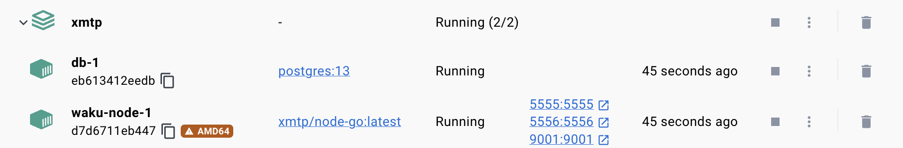

# xmtp-local-node

Use this repo to easily launch a local XMTP node for app development and testing purposes.

## Prerequisites

- [Docker Desktop](https://docs.docker.com/get-docker/) installed and running
 
## Launch a local XMTP node

```bash
docker-compose -p xmtp -f docker-compose.yml up
```

This will create and start an XMTP Waku node and a local database in Docker Desktop, as shown here.



## Connect an XMTP client to a local node

To configure your XMTP client to connect to the local XMTP node, set the `env` [client option](https://docs.xmtp.org/inboxes/create-a-client#configure-an-xmtp-client) to `local`.

## Common development workflows

### Create and start a node

```bash
docker-compose -p xmtp -f docker-compose.yml up
```

### Stop an existing node (preserves containers)

```bash
docker-compose -p xmtp -f docker-compose.yml stop
```

### Start an existing node

```bash
docker-compose -p xmtp -f docker-compose.yml start
```

### Stop and remove a node (removes containers)

```bash
docker-compose -p xmtp -f docker-compose.yml down
```
